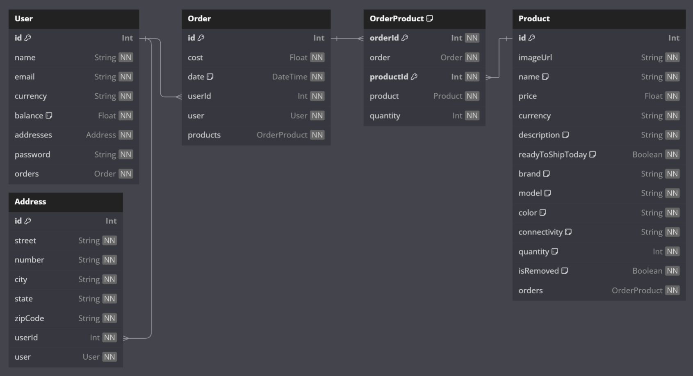

# How to run

  1. Clone repo and `npm i` 
  2. Install and run Desktop Docker 
  3. Execute `docker-compose -f docker-compose.yml build --no-cache && docker-compose -f docker-compose.yml up -d`.
  4. If fail to execute on docker, execute `npm run start:dev` as an alternative.
  5. Open swagger in browser at [localhost:3000/swagger/api](http://localhost:3000/swagger/api)
  6. Try out each route

# Tests
This api has only unit tests in *user module* due to time limit.
This api does not have e2e tests.

```bash
# unit tests
$ npm run test

# test coverage
$ npm run test:cov
```

# Usefull details

### Modules
 - user
 - product
 - order


### Tables in SQLite

